# 看板系统实施细则
> 版本 0.1.0
## 概述
本文档，从头分析公司的现状和相对相对应的解决方法，为了估计初学者，其中包含了较多篇幅的理论知识。如果要直接获取实施的细节可查看[实施细则]一节。

为了记录看板系统的实施的轨迹和演变过程，本文档将部署在版本库中，并以以版本化进行更新，切勿直接修改和更新。贡献者可以在公司[相关讨论组]中提交请求，经过讨论后，意见达成一致后才可以合并到本文档。

这篇文档目的就是讲述实施敏捷开发方法。可以作为成员敏捷入门培训文档。

## 背景
公司目前所有工作流程出现很多问题，公司遇到的问题也是大多数公司遇到的问题。因为公司现在没有一个具体有效的项目管理方法。导致项目进度不透明，开发效率慢，进度无法控制、成员各自为立不关心项目整体等后果。

一个重要的原因是公司目前软件开发流程基本上是“瀑布式”的。瀑布式开发是一种老旧的、过时的软件开发方法。这种开发方法使用严格分级制度，自由度很低，比如开发的流程分为这个几个阶段：“需求分析-设计-编码-测试-维护”，只有上一个阶段完成工作之后才能进行下一个阶段，这种串行化的开发流程本来效率就很低，且不能应对变化(或者应对变化的代价很大)。因为需求根本无法在一开始就确定下来。就算确定下来，可能是“不正确”需求。

严格的分级还可能导致需求信息在开发链条的传递过程出现关键信息丢失，导致与用户需求不一致。比如设计师是根据原型图的进行设计的，里面有自己的理解，而前端根据设计师的稿图进行开发，这时一些信息就可能丢失了。

信息沟通有一部分因素是由团队结构影响的。典型的瀑布式团队如下所示(图1)。这种模式下，职能团队是各自为立的，一个职能团队可能同时处理多个项目，一方面会分散注意力，另一方面混乱的项目关系，会使沟通复杂化。在小的公司这样没什么问题，如果在大公司，一个职能团队有许多程序，出现问题则需要一点时间才能找出相关责任人。

（图1）

团队成员不平等和对项目信息不对称会导致成员对项目整体认知和责任感不足。比如设计师将设计稿完成之后就不会再关心项目如何发展了，也不知道怎样去获取相关的信息，它成功失败与我没关系，成员之间的关联性不强。

还有一个是用户参与问题。公司目前最有两个阶段是有用户参与的，即需求分析阶段和最后的发布阶段。前面说了需求分析阶段是无法将需求明确下来的。而到最后的发布阶段，用户才发现不需要这个功能或者需求理解错误。一是导致产能浪费、二是在发布的最后阶段变更需求的代价非常大。用户的参与机会少，信息不对称，最后会可能产生信任问题。

另外，外包公司的一个通病就是只注重完成既定的业务，不重视产品质量、技术提升和相关基础设施建设。这往往导致公司一成不变，发展缺乏动力。只有鼓励业务外的技术创新和学习，才能为公司长久发展提供动力，反过来推动业务的发展。

所以我们需要在公司推广敏捷式的开发方法。

## 敏捷
敏捷不是一个新的名词了，在业界已经成为了一种软件开发活动的推荐模式。我们从以下几个问题来探讨敏捷这种开发模式。我们不会深入介绍敏捷，有兴趣的可以查看[参考文献]

### 什么是敏捷

(图2)

如上图所示，从敏捷的观点看，核心是敏捷价值观、敏捷价值观外层是敏捷管理，比如XP、Scrum、看板等敏捷框架，最外层是敏捷技术实践，比如持续集成、测试驱动开发等具体的技术实践。
**价值观**是很难形成的、价值观一旦形成、也就形成了公司自己的企业文化；**技术实践**也在公司人员水平不均衡，基础设施不足的情况下很难推广。因此运行敏捷的切入点是**敏捷开发管理方法**，这也是这篇文档的主题。
敏捷运行的核心要素就是**通过软件开发过程管理方法连接内层敏捷价值观和外层敏捷开发技术实践，对外呈现出一种开发模式和方法**。换句话说就是通过敏捷管理方法的实践促进形成敏捷价值观、发现流程痛点、推动敏捷技术实践。
本文档就是阐述Scrum + 看板 混合式软件管理方法的实践细节。

### 为什么要敏捷？
在上一节[背景]中已经阐述了公司目前的状况，敏捷就是为了解决上述问题的。总的来说敏捷可以解决三大问题：需求变化、开发效率、流程控制。下面会介绍，敏捷是如何解决这些问题的。

### 敏捷是如何解决需求问题的？
敏捷可以帮助开发团队和利益相关者更关注软件的交付，尽快满足客户的重要需求。使用敏捷及周期性反馈循环，开发团队和利益相关者能够关注到正确的需求上。做到这些需要实现以下几点：
1. 持续、细粒度的交付。敏捷的重点是“持续”，简单的说，因为需求是变化和不确定的，我们可以将先实现重要的、确定的功能，然后交付。一般情况下只有将产品摆在客户面前，他才知道还需要什么，这里做得不对。由于交付是短期的、小幅的，所以代价是很小的。接着得到用户反馈后，开发下一个循环。
2. 利益相关者与开发团队持续沟通
3. 关注需求可以给客户带来什么价值，避免产能浪费

### 敏捷如何提升开发效率？
1. **提升人件**。成员之间是平等的，通过敏捷团队的运作，激发出每
一个成员的最大潜能， 以最大合力完成产品的开发。
1. **团队建设**。每个团队都是一个自组织的团队，是一个项目的负责单位，可以将相关的人员凝聚在一起，每个成员都关心项目的成败、都对产品进行负责，以此激发成员的潜能；沟通效率最大化、同时也可以缓和团队气氛；鼓励技术交流和分享、提高成员的水平和能力；团队之间通过竞争实现公司的共同目标。典型的敏捷团队成员之间的关系是“图”形式的，如图2所示

（图3）

3. **软件开发过程的提升**。软件的开发过程包括需求分析、系统设计、编码、测试、交付、部署、上线等环节，要做到快速，就必须从多方面入手：
	* 需要把大需求拆分为小需求、从一次完成大而全软件系统交付转换为每次提供一个核心和关键功能最小软件系统快速交付，及时获取用户反馈，这样即使在需求环节出现偏差，也可以减低对于软件产品开发影响，减小需求偏离度，提升软件产品准确命中用户需求要点的能力；
	* 快速迭代。快速迭代可以逼迫团队不断优化流程、提升工作效率，不要在无足轻重的事情上浪费时间。如果离deadline还有6个月，那么整个工作节奏必然悠哉。如果每月发布一个版本，那么较以前效率必然会更高。如果发布周期过长，导致无法尽快发现用户需求，进而无法及时改进产品。
	* 需要提升整个软件开发弹性，引入代码走查、鼓励重构、结对编码和编码风格调整这些举措，让软件编码具有弹性，可以让软件对于后续变化和需求快速响应;
	* 为了保证软件产品具备快速交付能力，必须通过持续构建来解决系统经常代码改动对于软件产品交付能力的影响，分散产品发布带来的风险;通过自动测试来进行回归测试、集成测试以及系统测试，通过机器测试来换取测试压缩，解决人力测试无法满足测试路径快速覆盖的场景，随时具备软件产品交付能力。

### 敏捷如何对开发流程进行控制
敏捷本身没有说明如何对项目进行控制，我们是通过敏捷的一个软件管理方法，即**看板**，来实现开发流程的可视化和控制的。这个将在下文进行介绍。

## 基本理论
### 看板
#### 什么是看板
看板是近年来最为热门的**生产管理**、**流程管理**方法。是1⃣️计划管理、2⃣️项目实施、3⃣️进度反馈的一种高效展现形式。看板管理最初起源于丰田的“精益生产”，即为了JIT(Just In Time准时生产方式)而控制现场生产流程的工具。

#### 核心
1. 可视化工作流(价值流)。先将价值和价值流动具体可见，然后才是管理和优化。应用到软件开发中，**“价值”就是一个对客户有价值的功能**，具体的表现就是一张功能卡，里面阐述了用户的需求的功能，是一个可交付的最小单位。
2. 限制在制品(WIP)数量。 限制在制品数量是看板开发方法的核心机制，即标志该阶段允许的在制品的最大数目(即进行中和完成的价值项(功能卡)的和)。
 >  为什么要限制在制品数量？下文会解释
3. 显示定义流程规则。 即明确定义和沟通团队需要遵循的流程规则。其中价值项的“流转规则”是看板开发方法中最典型流程规则，它定义了一个价值项从一个阶段进入下一阶段所必须达到的标准。比如什么才是“可供开发”，什么才是“可供测试”。
4. 价值流度量和管理流动。快速、顺畅的价值流动是看板开发方法的目标。度量为改善价值流动提供方向参考，同时为改善的结果提供反馈。比如如何控制在制品的数量。
5. 协同改进。可视化、限制在制品数量、以及价值流度量、能够暴露产品中开发的问题和瓶颈。但是发现问题还不够，重要的是如何去解决它们。看板方法给出了两个建议，即团队协作和应用科学方法和模型

#### 看板的价值
1. 流程管理可视化。项目管理、开发迭代等等一切随着时间有着特定流向的工作，都可以利用看板管理达到整个团队计划的系统化、公开化、及时性。大家对项目的整体一目了然，而且可以实时显示工序流动的状态和瓶颈问题。促进资源的合理分配
2. 是重要的项目沟通工具，团队的沟通围绕着看板进行，如站立会议。
3. 信息同步。项目的开发速度很大程度取决于团队成员对项目当前状态的熟知程度，如果人人都清楚项目的进展和未来走向，就比较容易同心协力向目标挺进。
4. 看板是迭代的。可以将看板系统看作一条河流，上游不断产出，下游不断消费。不同阶段是并行的，如第一组功能进行了测试，第二组功能正处于开发、第三组功能正处于需求分析和用户故事细分阶段。
迭代式的开发模式可以快速发现问题，快速解决问题

#### 为什么控制在制品数量
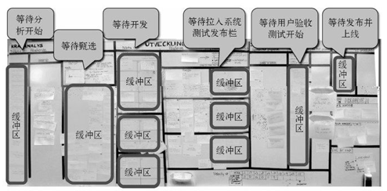

如上图所示，流程之间都有一个缓冲区，就像磁盘和内存之间、内存和CPU之间的缓冲区一样。流程之间的缓冲区是为了**控制流程的速率**，平稳的速率可以让流程更容易控制和估算。
1. 在制品可以避免同时做太多工作，避免让下游流程负载过重。比如测试人员手头已经有很多工作，我们就不希望开发人员再持续开发新功能，给测试人员增加负担，而是希望他们腾出手来帮助开发人员快速完成测试
2. 将看板和在制品限额结合运用可以发现瓶颈、促进自我组织并消除瓶颈。比如系统测试出现瓶颈时，开发人员调用人力去帮忙测试。

在制品数量不是具体可计算的，需要长期经验积累和磨合才能定下一个合适的数量，所以有时候在制品数量满了，大家就会没事干，这时会强制大家去做非常规的事情，比如开发去帮忙测试。下面会介绍如何根据数据流量和经验去确定在制品数量。

#### 如何确定在制品数量
一个经验公式： 在制品上限 = 团队规模 * 2 -1。 减1是为了让大家更多的协作。

#### 度量和管理流动
TODO

#### 典型的看板管理流程
来看一个简单的看板布局。

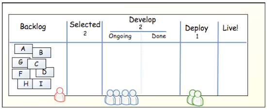

这个表格有5列，Backlog(原始需求)、Selected(被选中的需求)、Develop(开发阶段)、Deploy(部署阶段)、Live(已上线)。
A、B、C这些卡片、在看板中被称为在制品，也就是功能卡片。可以看作是工厂流水线上一个产品，它会在不同的工序之间流动。功能卡片带有一些文字描述，如标题、描述、优先级、测试指导等。
Selected、Develop、Deploy下面的数字就是在制品限制，表示最多能放置的功能卡数量。

现在开始看板的流程。

首先需求人员从Backlog栏挑选出优先级别最高的功能卡，即最重要且明确的需求，放进Selected栏。

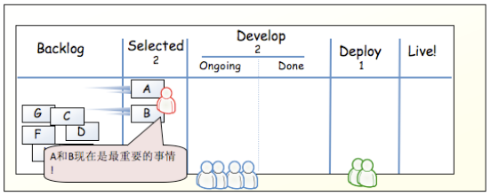

开发人员从Selected中拉取功能卡片，可以对其进行评估，这个评估值可以用于往后的绩效考核。接着分配任务到具体的开发人员

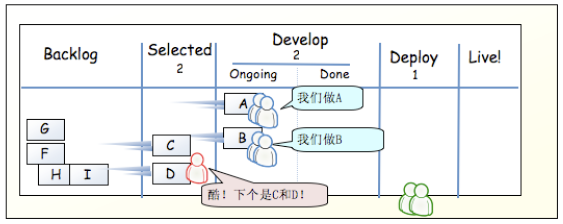

假设现在A功能做完了，那么A就可以移动到Done栏了。测试人员或部署人员可以从这里拉取功能卡进行测试或部署。
同时开发人员又可以从Selected中拉去新功能进行实现了。

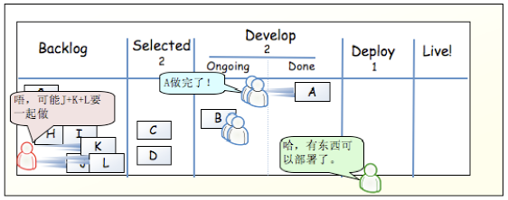

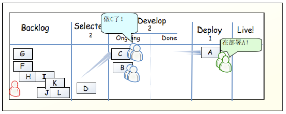

此时，部署A出现了问题，同时开发人员完成了B功能的开发，

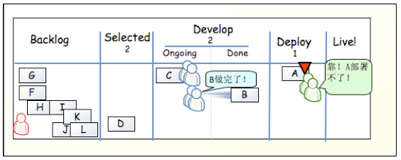

完成B任务后，开发人员本来可以做新的需求的，但是A部署没有通过，Deploy这里已经达到上限了，所以B无法向下传递。而且Develop的也达到上限了，所以开发人员不能再拉取新的功能卡了。

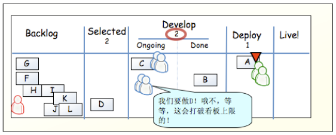

这时需要开发人员必须解决A问题，才能往下进行。

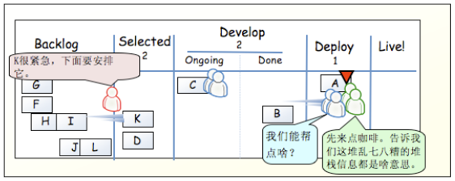

现在C任务也完成了，A还没解决，所以其他开发人员也来帮忙了。

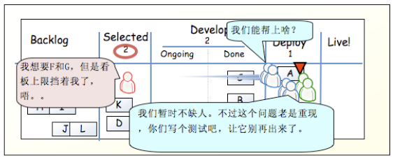

集中更多人的智慧来解决棘手的问题，是一个很好的学习过程。每个人都不在是各自为立，而是一个团队，目标就是把项目做好。

### Scrum
Scrum 是也是敏捷思想指导之下的，用于开发和持续支持复杂产品的一个过程框架。它的规则很简单，但是精通很难，我们采用的是看板辅助以Scrum混合的管理模式，不会照搬Scrum。由于下文会零散介绍，所以这里展开介绍。有兴趣者，可以参见[参考文献]。

### 流程概述

### 基础设施

### 总体目标

## 实施细则
### .1角色定义和团队建设
即定义一个自组织团队中不同的分工角色。这一部分参考Scrum的规范，我们将定义以下角色：
#### .1.1 产品负责人/需求分析人员
他们负责最大化产品和开发团队的价值。主要工作是管理产品待办列表，即功能卡列表。其中包括：
	1. 分析用户的需求，最后以功能卡的形式输出。
	2. 对功能卡列表进行优先级排序和分类，以更好地实现项目的目标
	3. 清晰地表述功能卡，确保开发团队对功能列表又足够深的了解。即确保成员了解需求，解答成员的对需求的疑问。
	4. 保证功能卡列表是对所有人是可见的、透明的和清晰的，同时显示开发团队下一步要做什么。
#### .1.2 开发团队
开发团队中包含了各种专业人员，比如客户端开发、和服务端开发，它们**共同**负责将每轮迭代(在Scrum中称为一个**sprint**)中计划的功能卡，在迭代结束后交付潜在的可发布且“完成”的**产品增量**。简单的说就是把功能卡在规定的周期内转换成可以发布的代码。什么样的代码才算“完成“是需要明确定义的，下文会尝试对它进行一个规范化的定义。

Scrum开发团队有以下特点：
1. 它们是自组织的。 即没有人有权告诉团队怎样去完成任务。团队自己选择自己最好的方式来完成工作，而不需要团队之外的人来指导。
	这对领导者来说可能是好事，因为团队是“自立”的，对于领导者来说，不必过多干预，只关注结果，将压力给予一个团队，这个团队只有通过加强协作来提高效率，才能更好完成任务。
2. 开发团队是跨职能的。即团队作为一个整体，拥有创建产品增量所需的全部技能，不依赖于团队之外的人。团队的跨职能决定了它是自组织的。
3. 没有子团队。一个团队内不可以再有所谓的子团队。这是为了强调团队是一个整体，共同承担责任，形成一个利益共同体。
4. 强调平等。不认可任何成员的头衔，都是开发人员。目的跟上一点一致，为了让团队形成一个整体，自由共享信息，共同决策，否则决策权仍然掌握在少部分人手里。

团队的规模。团队规模应该足够小以保证敏捷性，同时足够大可以在迭代周期内完成重要的工作。经验而言，大于3人小于9人是最佳的，即可以保证协调沟通工作，又可以避免技能上的约束。

如何实现跨职能？
跨职能是一个团队最基本的要求。公司目前规模(截止2016.12.26)为2个后端、3个前端、2个设计。就公司目前的人员状况和业务状况而言，我们可以划分为两个团队，一个团队中至少拥有一名前端、一名后端和设计，这样可以符合Scrum的第一个特点，即**跨职能**。
> 当前，现在人员显然是不足的，在这么小的团队里，每个人都必须是能够独当一面的。就我们公司而言，一个理想团队的结构是：需求 x 1, 设计 x 1,  前端 x 2，后端 x 2, 测试 x1。人数控制在9个人以内，确保敏捷性和完全项目所有的职能。

如何实现自组织？
1. 为了实现自组织，我们需要以团队为**最小单位**来分配项目。由团队自行组织由需求分析到开发、再到测试、上线整个过程。团队只关注自己的项目，项目不能超出团队范围，以免打破团队凝聚(比如让团队foo的前端来对接团队bar的后端)。
2. 团队是自立的，不受外界干预。让团队自己解决自己的事，迫使其发挥集体力量。比如团队缺乏人手，可以考虑让团队自己去招兵买马，培养新人，或者举行技术培训来充实自己的团队力量。
3. 竞争机制。前面说到，我们计划分为两个团队，就是营造出竞争的氛围。只有竞争才有进步、才有活力，进而推动团队自组织。可以适当地推行一些项目奖励机制，团队的能力决定其能接下什么样的项目。
4. 成员平等，集合决策。比如让测试人员和开发者参与需求讨论。需求讨论以研讨组形式展开最有效率。这种方式可以充分利用团队成员间的互补性，让每个成员都有参与感。
5. 在一起工作。最好的方式就是坐在一起。
6. 如非特殊情况，不要变动团队成员。团队成员最好是固定，长期协作的。协作效率跟团队之间的默契程度相关。
7. 培养感情。团队成员之间的感情好坏影响合作的效率。同时也可以保持稳定的团队结构。通俗的讲可以减少成员跳槽

> 试点团队。在看板系统实施的过渡阶段，可以组织一支“试点团队”，对看板系统进行一两个项目的实践，在这个期间熟悉看板规则，培训看板实施教练(见下一节)，改进看板流程。这支“试点团队”每个成员最好都能独当一面，以顺利地实施看板系统。

#### .1.3 实施教练
在看板系统实施期间去需要一个实施教练，主要负责保证所有人能够正确地理解并实施看板系统。所以实施教练必须熟悉和理解看板系统，至少本文档的内容能够理解。需要注意的是，教练只是实施的组织者，而不是领导，他仅仅是以一个组织者。
主要职责:
1. 规划看板系统的实施
2. 帮助解决实施中的问题
3. 组织一些会议
4. 培训其他实施教练

### 功能列表
功能列表，也成产品backlog。它是所有流程的核心和起源，**由产品负责人进行维护**。功能列表是需求或故事或特性等组成的列表，按照重要程度进行排序。里面包含了客户想要的东西，并用客户的术语描述。功能列表主要通过excel进行维护。
一个功能列表项可以包含这些字段：

|字段             | 描述          |
|-----|-------------------------------------|
|ID                                  |   功能的唯一标志符(可以防止以后重命名时找不到它)  |
| Name                          |  简短、描述性的故事名，如“修改用户权限”                  |
| Importance                | 产品负责人评出的一个数值，说明这个故事有多重要  |
|Initial estimate            |  团队的初始估算值，表示完成该故事所需要的工作量，这个是有开发团队在计划会议时估算的，产品负责人留空|
|how to demo             | 如何演示，即如何进行验收测试，产品负责人描述如何故事的正确行为，可以知道测试人员进行测试|
| note                            |  其他相关信息             |
|Track(可选)                  |  故事的大致分类，一般不需要这个字段 |
|Requestor(可选)         | 请求者， 相关责任人    |

> 功能列表应该停留在业务层次，不要过度地关注业务的细节，如使用什么技术实现。产品负责人不需要关注这些，只需要关注“是什么”，“怎么做”是开发团队的事情。

### 会议和节奏

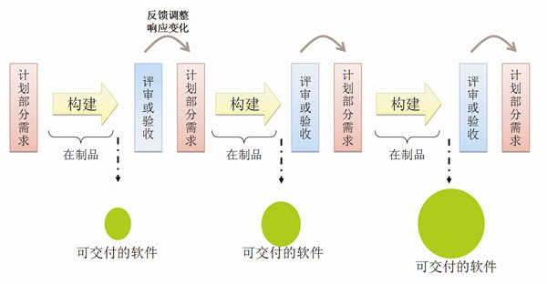

瀑布式和敏捷的明显区别就是开发流程分割成多个迭代过程。按Scrum的话说就是使用固定的事件来产生规律性，这个特定的事件就是sprint。在本文档中，我们遵循Scrum规范，将一次迭代过程称为”**Sprint**”。

#### 确定sprint的长短
Sprint的持续时间是固定的，不能缩短或延长。按照经验我们必须将Sprint长度限制在一个月内，周期短才可以确保开发的敏捷性，即更短的反馈周期，更频繁的交付，更频繁的客户反馈，在错误的方向上花更少的时间。如果太长复杂度可能会增加、同时风险也有可能会增加。通过将周期限制在一个月内，也就罢风险限制在一个月的成本上。通常三个星期是一个普适的长度。
在一个Sprint周期结束后，新的Sprint会立即开始。为了提高团队的战斗力，团队内举行的学习活动会在两个Sprint之间进行。比如在每个Sprint之间安排一个实验日，除了可以得到自然的休息，团队也可以让自己了解前沿的知识，团队内进行技术培训等等。

#### Sprint计划会议
在开始一个Sprint之前，我们都需要开一个Sprint计划会议，讨论在这次Sprint中要开发些什么，我们会在计划会议中确定需要完成的功能，即“故事”。然后在Sprint结束时产出一个”完成的”、“可用的”和潜在可发布的产品增量。完成后的产品向用户或直接负责人进行演示，接受反馈，这样可以减少犯错误的风险。
Sprint计划会议是一个Sprint的开头，开头好坏直接决定整个Sprint的是否能顺利完成。

##### 参与人
Sprint计划会议要求整个开发团队和产品负责人都要参加。他们共同来决定下一个Sprint中要完成的故事。产品负责人需要对功能列表按重要性进行排序，开发团队需要对故事的工作量进行评估。产品负责人和开发团队难免会存在分歧，在计划会议上需要进行讨论和调整。
##### 确定Sprint的目标
每个Sprint计划会议都要确定一个目标，即为什么要进行这个Sprint，如果没有目标就没有必要进行这次Sprint了。确定一个目标可以确保所有人知道公司是干什么的，目标又是什么，确保团队能够同心协力，完成目标。
##### 估算团队生产率
即量化团队在一个Sprint内可以完成多少工作。一个团队的生产率是有限的，我们不提倡超出团队负荷的情况下来完成工作，所有我们需要尽量精确地估算团队生产率，以便有计划地进行开发工作。当然一个团队的生产率有很多因素影响，比如突发事件，成员心情、身体状态、成员水平差异等等。
我们以“人_天”为单位来量化生产率，“人／天”也称为”故事点”,  “人_天”是一个理想的、高效的、不受干扰的一天，一个人员能够完成工作量。我们这里忽略了成员之间效率的差异。

比如:

| 成员 | 一个Sprint出勤的天数 |  备注   |
|----| -------------------|----|
| 成员A   | 15  |   |
| 成员B   | 12  | 请假3天 |
| 成员C   | 15  |     |
| 总计    | 42  |     |

上面所示，一个Sprint中，“理想的“的生产率为42 人/天
上面说到，影响生产率的因素有很多，我们将这些影响因素抽象为 “投入程度”。投入程度可以根据团队的Sprint历史数据计算出来平均值，对于一个全新的团队，我们可以使用 70% 作为投入程度。
假设我们是一支全新的团队，那么最后的生产率估算值为:
`42 x 70% = 29.4`

假设我们已经进行了多次Sprint，历史估算值如下：

| 生产率估算值  |   实际生产率 |
|-------|----|
| 32         |    26      |
| 30         |   22      |
| 31         |    28     |
| 总计: 93    |      76   |

投入程度为 `76 / 93 = 81.7%`

##### 估计故事的工作量
开发团队从功能列表中选取故事，对故事的工作量进行估计。这里**要求每个开发成员都参加估算**。原因如下：
1. 一般一个故事有好几个人参与，比如用户界面设计、编程、测试。
2. 要求团队成员必须对故事内容有一定的了解才能估算，
3. 我们常常发现两个人对同一个故事的估算差异较大，这可能是对故事的理解存在不一致，我们要求每个成员对故事有一致的认知。产品负责人必须确保这一点。

精确的估算是建立在对故事的了解程度，以及成员的经验上的。下面的技巧可以帮助成员对故事进行更精确的估算：
1. 将故事划分任务。 将故事划分为粒度更小的任务后，可能会发现一些会导致时间估算增加的工 作，最后可以对故事进行更为精确的估算。将故事划分为任务也可以放在每日立会中进行。
2. 注意故事的粒度。
故事不宜太短或太长。故事如果太小，如一大堆0.5故事点的故事，就会陷入微观管理，导致故事列表维护工作过于繁琐。故事如果太大，将导致一个Sprint下做不完，即故事无法在这个Sprint后完成交付，这样是没有意义的。根据经验，故事大小保持在2-8之间为宜，产品负责人在建立功能列表时把握好故事的粒度。

那么现在如何对故事进行估算？很多团队都使用估算扑克来做时间估算。典型的估算扑克如下，每个人都会分得如下13张牌。一般情况下，推荐4-8个人参与估算，因为人数太多，会拉长估算时间，降低估算效率，人数太少估算结果偏差就会很大。

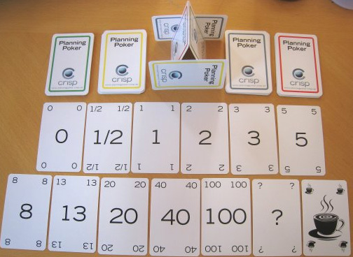

简单流程：
1. 产品负责人从功能列表中选取一个故事，为大家详细讲解该故事。
2. 团队成员针对故事进行讨论并提出问题，产品负责人解答问题。团队可以按上面的技巧对故事进行细分，加深对故事的了解。
3. 当团队成员确认已经对故事完全了解、无任何重大问题后，大家开始对该条目进行估算，同时选出代表自己估算值的纸牌。在估算的过程中，为了避免干扰估算结果，团队成员之间不可以互相讨论。
4. 选牌完毕后，大家同时亮牌。同时亮牌是为了，避免跟风。
5. 如果存在两张牌，估算值差异明显，代表大家对该故事没有获得共识。团队需要对该故事评估结果进行讨论。
6. 重复3、4、5直到团队对该故事的评估值达成一致。

在估算完故事之后，就结合团队的生产率，选取故事放入Sprint 功能列表中了。

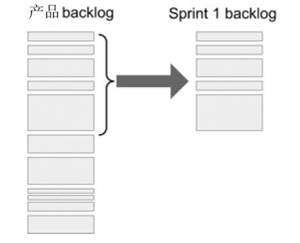

##### 如何处理技术故事
在一个Sprint周期内，除了处理用户的故事，还需要处理其他技术相关的问题。如构建持续集成服务器、编写自动化测试。我们将这些技术相关的故事称为”**技术故事**”。技术故事是指需要完成的但不属于可交付的东西，跟任何故事都没有直接关联，不会给产品负责人或用户带来直接价值。即产品负责人和用户是看不见的，但是它们也非常重要，它会影响项目的开发效率，可维护性、运行性能、安全性等等。
那技术故事的问题在于哪里？由于技术故事与业务无关，产品负责人一把会轻视或无法理解它，看不到它们的价值所在，不能做出正确的权衡。所以往往会将他设置为一个很低的优先级。我们可以从以下三个方面来处理：
1. 试着将技术故事转换成可以衡量业务价值的普通故事，放进功能列表中
2. 看看能否作为另一个故事的某个任务
3. 如果以上方法都不可以，则将它定义为技术故事，用另一个单独的列表来存放。注意这个列表由开发团队进行管理，产品负责人不能编辑它。像普通故事一样，需要对其进行估算，并从Sprint中分出一些时间来完成这些故事。

##### 如何处理bugs
像技术故事一样，bug也是不会给产品负责人带来价值的，但是需要被处理。类似于处理技术故事，可以通过三个方面处理bugs：
1. 产品负责人选取**bug跟踪系统**中优先级最高的一些bug，像普通故事一样处理它们
2. 产品负责人创建一些指向bug跟踪系统的故事。如“修复那几个后台报表最严重的bugs，ID为 b1， b2, b3”
3. 将修复bug当作Sprint之外的工作，在每个Sprint中，团队使用一定的时间来修复bug跟踪系统上的bug
##### 最后
最后发布Sprint计划会议报告，比如我们的boss。这是为了让别人了解我们团队的在干什么。报告的示例如下：

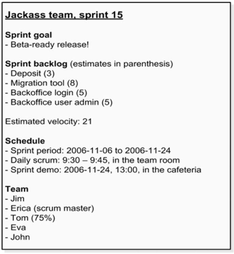

报告的内容主要包括Sprint的目标，日程表，团队投入等等。我们会将这份报告发送给所有人，另外还打印出来，贴在团队的项目板上。

#### 每日立会
每日立会是一个15分钟为限制的会议，一般在每个早上固定时间进行。每天都开会可能会让某些人心生恐惧，但是不用怕，每日立会一般不可以超过15分钟，而且是以站立的形式进行的。
每日立会很有必要的，它的主要目的是同步开发团队的开发活动。我们的开发活动是以看板为中心的，所以每日立会的目的可以等同于更新看板的状态，计划今天要做些什么。另外每日立会可以增进交流沟通、减少其他会议、发现开发过程中需要移除的障碍、凸显并促进快速地做决策、提高开发团队的认知程度。
##### 参与人
产品负责人、开发团队。
##### 内容
每个开发团队成员必须说明：我昨天做了什么；我今天打算做什么；我遇到了什么问题。
每个人在讲述自己的工作一边移动任务板上对应的功能卡。
每日立会结束后，还要计算和更新燃尽图。

#### 回顾会议

### 看板

实施细节
### 版本控制
## 参考文献(Reference)
1.  [敏捷式 vs. 瀑布式：软件需求最佳方式](http://www.searchsoa.com.cn/showcontent_89648.htm)
2.  [什么样的敏捷开发是我们真正需要的 ](http://www.searchsoa.com.cn/showcontent_80639.htm)
3.  [敏捷开发的六个实战经验](http://www.searchsoa.com.cn/showcontent_80257.htm)
4. [大型敏捷项目之道分而治之：适宜的团队](http://www.searchsoa.com.cn/showcontent_80698.htm)
5. [Scrum vs. 看板，还是Scrum + 看板？](http://www.jianshu.com/p/e44b1038c9cf)
6. [解析精益产品开发（一）—— 看板开发方法](http://www.infoq.com/cn/articles/kanban-development-method)
7. [解析精益产品开发（三）——面向价值的可视化](http://www.infoq.com/cn/articles/value-oriented-visualization)
8. [看板管理法：打造团队完美计划 ](http://www.jianshu.com/p/d5cf16a85cca)
9. [敏捷开发创始人Martin Fowler：估算的目的](http://www.csdn.net/article/2014-04-24/2819467)
10. [敏捷估算扑克](http://www.techexcel.com.cn/newsevents/relatedarticles/20100304-4.html)
## 更新历史
## 文档贡献者
